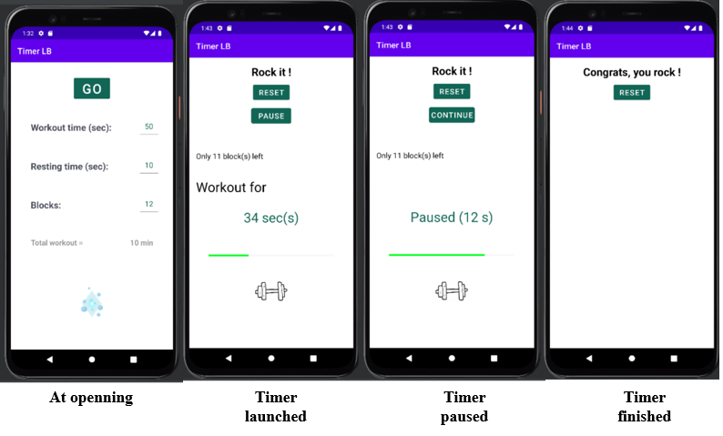

# Timer LB

Timer LB is a simple but useful interval training timer for Android.

</a>

## How to use Timer LB

### Workout structure

A workout with timer LB comprises a sequence of rest and work blocks. For example, a workout with two workout blocks will look like

1. block #1
2. rest
3. block #2
4. rest

The length of workout and rest are configurable. By default, it is respectivelly 50 and 10 seconds.
The number of blocks is configurable. By default, it is set to 12 blocks.
The default configuration brings a total workout time of 10 minutes

### Block structure

A block is a series of work/rest interval pairs. 

### Audio and visual cues

Timer LB always gives a warning when you're about to transition to a new interval. 
It consists of one beep from workout to rest, two beeps at start or from rest to workout and clapping at finish.

Once the timer is launched, you will see written how much time is left and if it is for resting or working out.
You will also see a green progress bar indicating how much time is left.

During workout session, a dumbbell will be on the screen, else three sleeping Z will be displayed.

Once the timer is done, a special beep will ring and "DONE" will be written.

### Pause workout

You can pause the timer using the PAUSE button. A CONTINUE button will then appears. Get back to the session tapping it.

### App screen shot

---

## How to install the app 

1. Download the APK file of the TimerLB app : <a href="https://github.com/JLefortBesnard/timerLB/blob/main/release/timerLB_1.1.apk">Click here to download the ast version</a>.
2. You need to allow your webbrowser (Chrome, Firefox, etc...)to install unknown apps by going to Settings > Apps > Menu > Special access > Install unknown apps.
3. Download the APK file and open it to install it. 
4. That's it !

---

## License

Permission is hereby granted, free of charge, to any person obtaining a copy
of this software and associated documentation files (the "Software"), to deal
in the Software without restriction, including without limitation the rights
to use, copy, modify, merge, publish, distribute, sublicense, and/or sell
copies of the Software, and to permit persons to whom the Software is
furnished to do so, subject to the following conditions:

The above copyright notice and this permission notice shall be included in
all copies or substantial portions of the Software.
 
THE SOFTWARE IS PROVIDED "AS IS", WITHOUT WARRANTY OF ANY KIND, EXPRESS OR
IMPLIED, INCLUDING BUT NOT LIMITED TO THE WARRANTIES OF MERCHANTABILITY,
FITNESS FOR A PARTICULAR PURPOSE AND NONINFRINGEMENT. IN NO EVENT SHALL THE
AUTHORS OR COPYRIGHT HOLDERS BE LIABLE FOR ANY CLAIM, DAMAGES OR OTHER
LIABILITY, WHETHER IN AN ACTION OF CONTRACT, TORT OR OTHERWISE, ARISING FROM,
OUT OF OR IN CONNECTION WITH THE SOFTWARE OR THE USE OR OTHER DEALINGS IN
THE SOFTWARE.

Copyright (c) 2022 Jeremy Lefort-Besnard <losangebleu.site> <jlefortbesnard@tuta.io>
